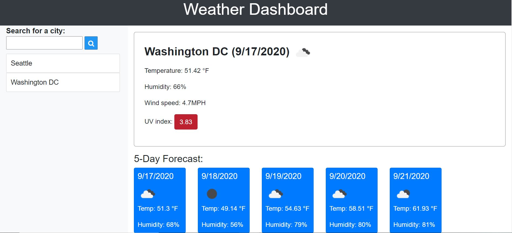

# Weather-Dashboard

## Overview

This weather forecast app returns the current weather and 5-day forecast data for a city. Simply type the name of the city into the search field and search, the dashboard returns the current weather data and the 5 day forecast below. The data includes date, temperature, humidity, wind speed, weather condition and uv index.

### Usage

To use this app, copy and paste the url below to browser:

https://linhgt.github.io/Weather-Dashboard/

### Technologies

HTML, CSS, Javascript, JQuery, Bootstrap

### How it works

Open up the app, on the left side is the search bar and search history.

Type the city name into the search bar and click the search icon,, the current data is retrieved on the right and the 5 day forecast below it.

The city is recorded under the search box, user can clicks the city name to see the data again. In the future users can look at the city again

### License

None